# RepoLens

> 一个**本地优先的桌面 AI 编码工作台**：AI 直接在你的代码仓库里读、改、验证，而它做的每一件事——改了什么、为什么、动了哪条业务流——你都看得见、查得到、能回退。
>
> *A local-first desktop AI coding workbench. The AI reads, edits and verifies code right inside your repo — and every move it makes is observable, auditable, and reversible.*

---

AI 写代码越来越快，可**人跟不上了**。它改了一堆东西，你不知道对不对、动了哪条流程、要不要合。评审成了瓶颈，"AI 写的"渐渐变成"没人真看懂的"。

RepoLens 想解决的就是这个：它把一套**自己从零写的 AI 执行内核**（对标 Claude Code）装进一个桌面 App，让 AI 像个靠谱的同事一样干活——**先读懂、再动手、改完自己跑编译和测试验证**；与此同时，它把 AI 的每一步改动**实时喂进左边的一排"可观测"工具**：需求流、调用图、时间轴、敏感文件、贡献溯源。于是"AI 到底干了啥、干得对不对"，一眼就清楚。而且，你的代码全程留在本地。

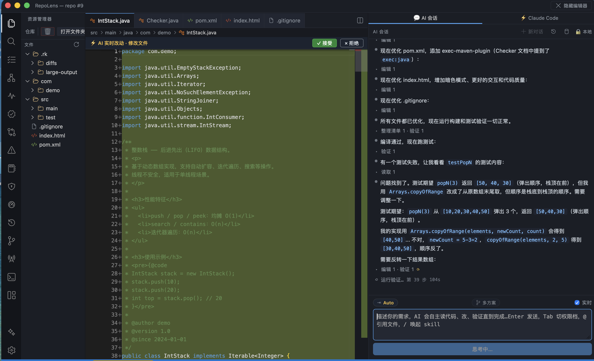

---

## 它有意思在哪

### 🧠 一套自研的 AI 执行内核（不是套壳）

从零重写，对标 Claude Code 的 Agent Harness：

- **改完自己会验证**：AI 的改动先落到一个隔离副本里，在那儿**真跑编译、真跑测试、还断网**，确认没问题才算数——没有"我觉得改好了"，只有"编译测试都过了"。
- **收尾前的对抗性自检**：AI 准备说"搞定"之前，会被强制扮演一个"想挑你毛病的评审"，专门拿 `10/4=2.5`、负数、空值、边界这些最容易出 bug 的输入**真的跑一遍对答案**。核心思路很朴素：不指望模型"想到"会错，而是逼它"跑出来"看到错。
- 还有：五档权限（从只读规划到全自主）、上下文压缩、Hooks、会话检查点（可回溯）、只读子代理。

### 💬 需要你拍板时，问得干净

遇到方向性的选择，它会弹一张**可点选的卡片**问你（能左右切换多个问题、能多选），而不是甩一大段文字——就像 Claude 那样。

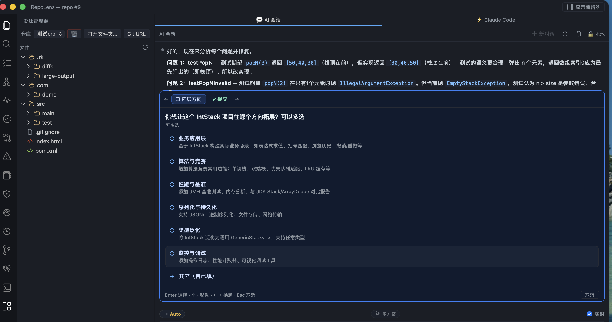

### 👀 AI 干的每件事，都看得见（这是最核心的差异化）

AI 每改一次代码，这些工具就自动更新：

| 需求流：AI 的改动被归纳成一条"需求"，点开看它动了哪条业务流 | 敏感文件：谁改得勤、AI 占比多高、被多少地方依赖 |
|---|---|
| 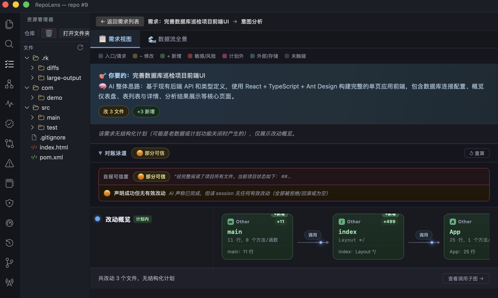 | 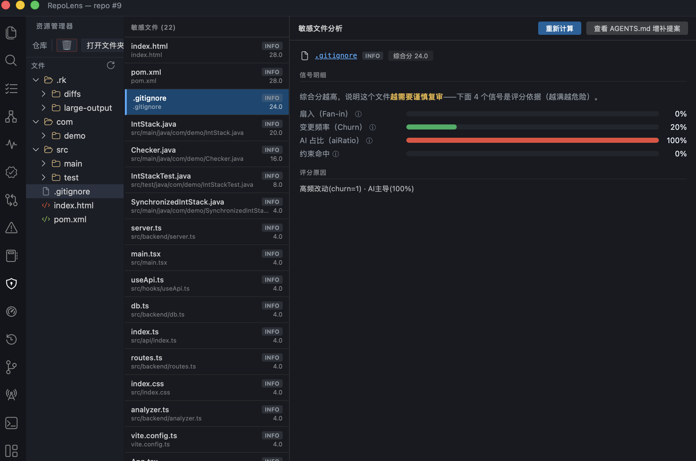 |

| 调用图：符号级依赖关系一目了然 | 架构时间轴：符号级的演化回放 |
|---|---|
| 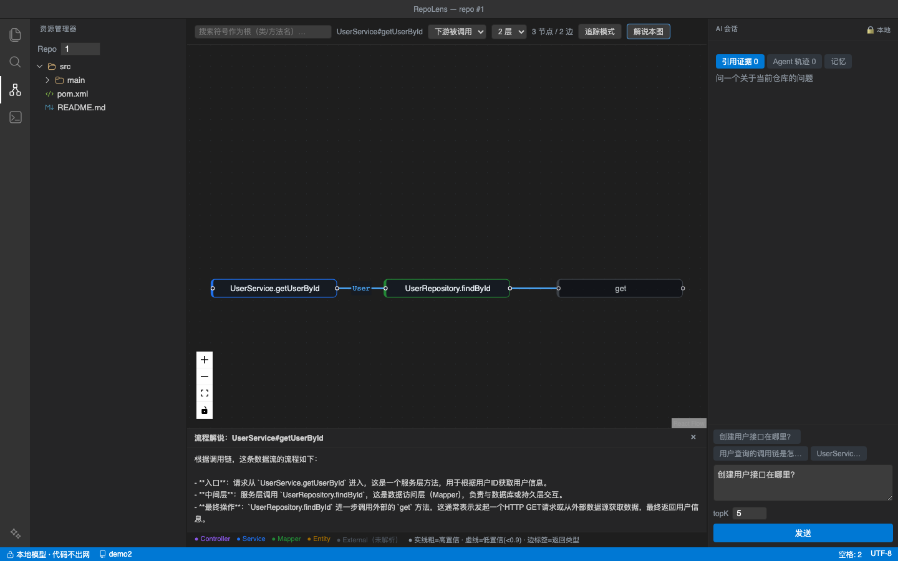 | 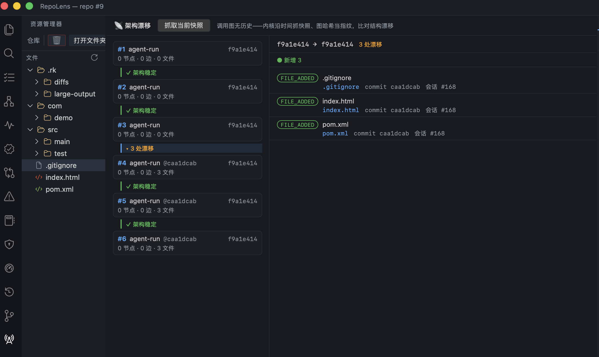 |

**理解债务**里，选中一个文件，AI 会把"这个文件在项目里干嘛、跟它相关的业务前因后果"讲清楚，相关文件和函数还能**点一下直接跳过去**——帮你真正读懂，而不是考你。

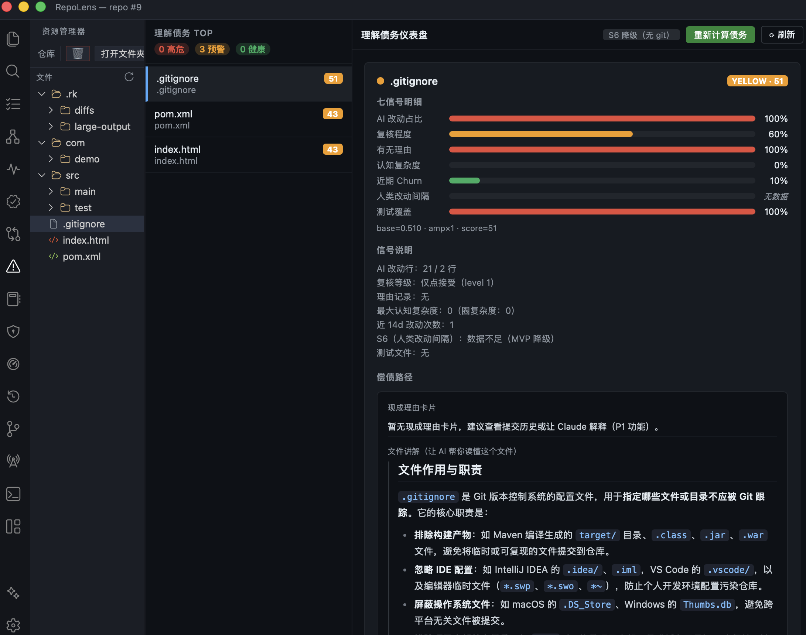

**AI 贡献溯源账本**——每一次 AI 改动，哪个模型、谁批准的、prompt 指纹、哈希链，都留痕可查（对合规友好）。

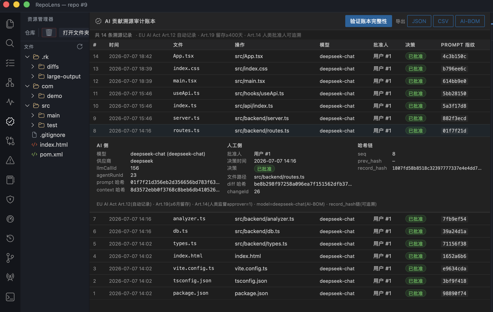

### 🔒 隐私优先，但不碍事

你的代码只在本地读写。真正要防的是"把你的私有代码泄漏出去"——这个由出网策略网关治理（本地专用 / 白名单 / 放行三档），而"联网查点公开资料"这种取知识的事不受影响。更妙的是，本应用发起的**每一条出站连接**都被记下来、可实时查看——到底连了谁、放行还是拦截，一清二楚，"代码 0 出网"不再是口号而是能验证的。

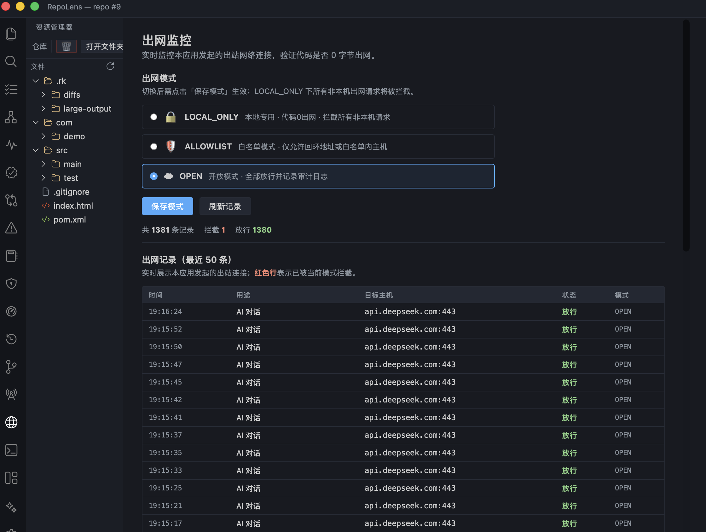

### 🧩 想接什么模型都行

DeepSeek / OpenAI / Anthropic / Gemini / 通义 / 智谱 / Kimi / 本地 Ollama / 任意 OpenAI 兼容端点，设置里一处切换；界面**中英双语**可切。

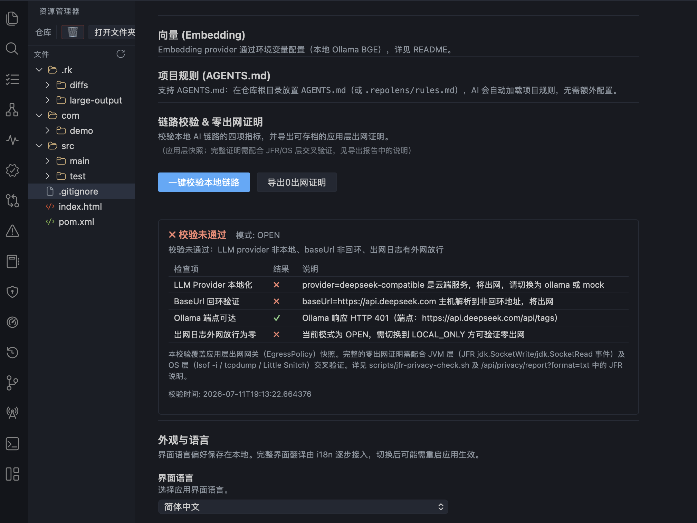

> 顶部还有一个 **Claude Code** 标签页——想用官方 Claude Code 终端也行，两种引擎并存。
>
> 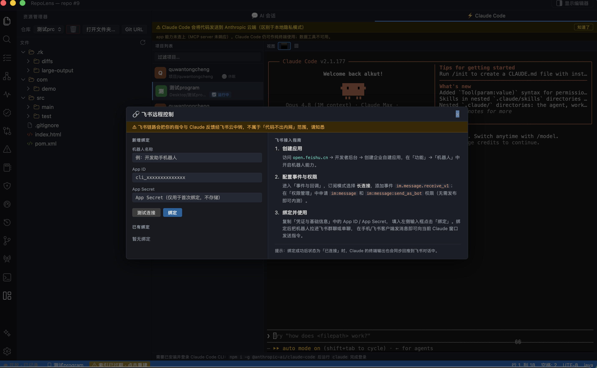

---

## 🚀 三步跑起来

```bash
# 1) 起中间件（默认部署 0 外部依赖；向量库 Milvus 是可选项）
docker compose up -d mysql redis rocketmq-namesrv rocketmq-broker

# 2) 后端（大模型走环境变量，key 绝不入库）
export JAVA_HOME=/path/to/jdk17
export REPOLENS_LLM_PROVIDER=openai REPOLENS_LLM_BASE_URL=https://api.deepseek.com \
       REPOLENS_LLM_MODEL_NAME=deepseek-chat REPOLENS_LLM_API_KEY=sk-你的key
export REPOLENS_KERNEL_AGENT_ENABLED=true          # 打开自研内核
mvn -o spring-boot:run

# 3) 桌面 App
cd repolens-desktop && npm install && VITE_API_BASE_URL=http://localhost:8083 npm run tauri dev
```

- **想完全离线**？把模型指向本地 Ollama 即可；`provider=mock` 连模型都不用配，也能跑通整条链路。
- **要发布版**？`cd repolens-desktop && npm run tauri build` → 生成 `.app` / `.dmg`，双击即用、不用再编译。

---

## 🔬 顺便，做了个消融实验

内核里那些机制，到底有没有用？自己搭了个评测（7 种配置 × 4 个真实编码任务，全程真跑 DeepSeek + 自动判分）：

| 配置 | 成功率 | AI 谎报"我做完了" |
|---|---|---|
| **全组件** | 4/4（100%） | 0 |
| 去掉**对抗性自检门** | 3/4（75%，↓25pp） | 1 |
| 去掉**验证步** | 3/4（75%，↓25pp） | 1 |

去掉"自检门"或"验证"任意一个，成功率就从 100% 掉到 75%，还各出现一次"AI 自称完成、判分其实没过"——失败点都精准落在同一个整数除法丢精度的 bug 上。说明这两个机制真在拦真 bug，不是摆设。

> 老实说：每格只跑了 1 次、任务也就 4 个且偏小，这数字是**指示性**的、不是严谨统计。后面几个组件在这套简单任务上没拉开差距，得设计更针对性的任务才能验证。（把丑话说前面，比藏着好。）

---

## 🧱 技术栈

| 层 | 用了什么 |
|---|---|
| 桌面端 | React 19 · TypeScript · **Tauri 2**(Rust) · Vite · Monaco · reactflow · xterm · zustand |
| 后端 | **Java 17 · Spring Boot 3.3** · MyBatis-Plus · JavaParser · jtokkit(真 BPE 分词) |
| 大模型 | 可插拔：DeepSeek / OpenAI / Gemini / 通义 / 智谱 / Kimi / Ollama / 兼容端点；function-calling + SSE 流式 |
| 多语言解析 | JavaParser(Java) + tree-sitter sidecar(TS/JS/Python 等) |
| 存储 / 中间件 | MySQL 8 · Redis · Milvus(向量，可选) · RocketMQ |

```
桌面 App (Tauri)  ──REST / SSE──▶  Spring Boot 后端
                                     ├─ 自研内核 com.repolens.kernel.*
                                     │    loop · 工具(read/edit/grep/bash/skill/web…) · verify · perm · ctx · skill
                                     └─ bridge：把 AI 改动实时喂给左侧可观测工具
                                          ▼
                                     MySQL · Milvus(可选) · Redis / RocketMQ
```

---

> 隐私优先的个人作品集项目。演示用示例仓库；大模型云端本地皆可，代码可完全不出内网。
